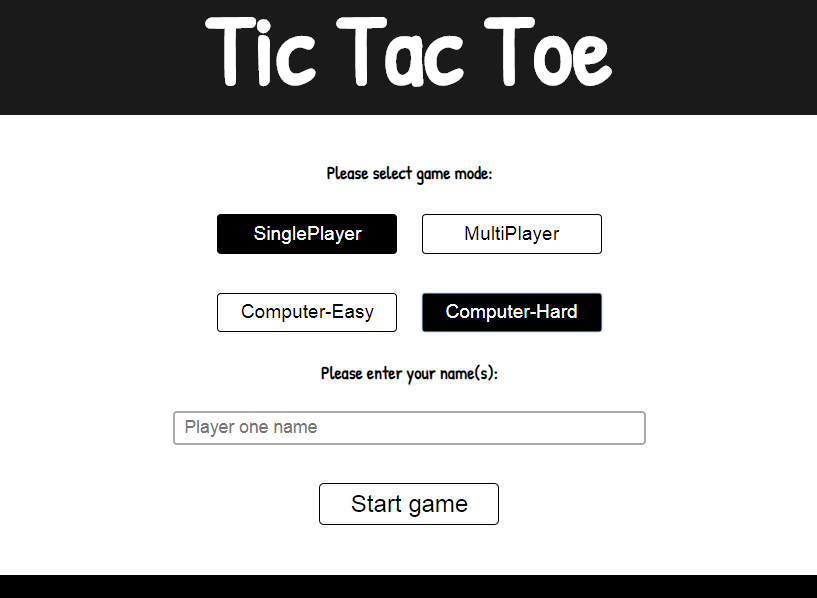
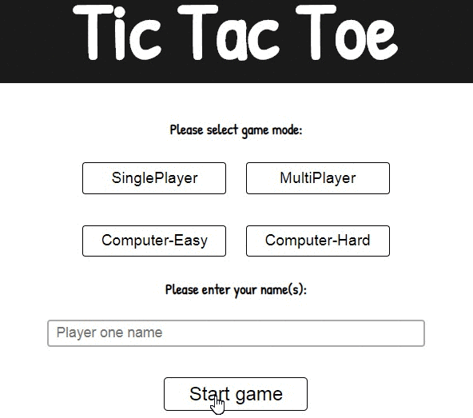
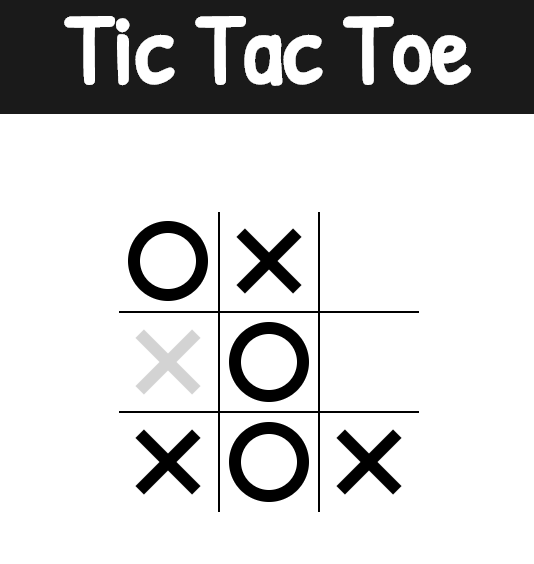
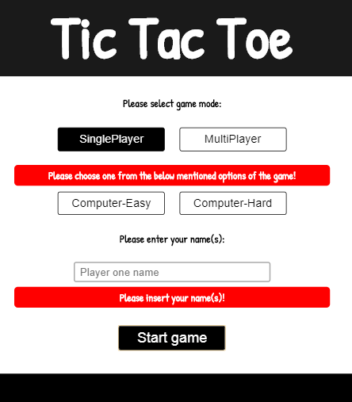

## General info
This is a Tic-Tac-Toe game.
I incorporated a Player vs Player game mode as well as Player vs AI with two different difficulty levels. 
The unbeatable AI  was built using the minimax algorithm.
I've added also input fields validation.
	
## Technologies
Project is created with:
* HTML5
* CSS3
* JavaScript

## Screenshoots






## Live
https://makarcodes.github.io/TIC_TAC_TOE/
	
## Setup
To run this project, install it locally using npm:
```
$ cd ../tic_tac_toe
$ npm install
$ npm start
```
